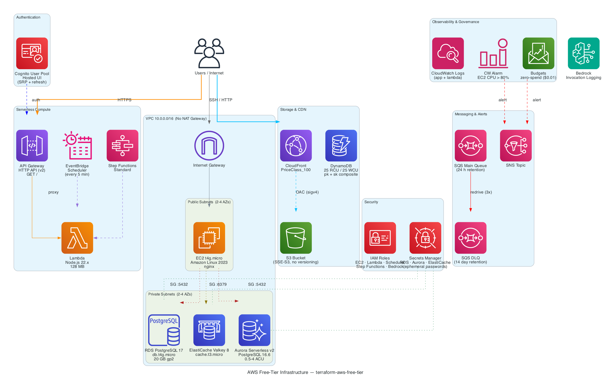

# AWS Free Tier Terraform

[](https://github.com/cloudplz/terraform-aws-free-tier/releases/latest)
[](https://registry.terraform.io/modules/cloudplz/free-tier/aws/latest)
[](https://github.com/cloudplz/terraform-aws-free-tier/actions/workflows/ci.yml)
[](LICENSE)

Spin up 20+ AWS services in a single `terraform apply` — fully optimised for the AWS Free Plan
(post-July 2025). Get $200 in credits plus 30+ Always Free services, and automatically earn all
5 credit-earning activities ($20 each = $100 bonus).

## Prerequisites

> [!IMPORTANT]
> **This module requires the AWS Paid Plan.** On the Free Plan, AWS blocks `CreateDBCluster` for
> Aurora (`FreeTierRestrictionError`) due to a [missing provider parameter](https://github.com/hashicorp/terraform-provider-aws/issues/47117).
> Switching to the Paid Plan preserves your full $200 in credits and removes all service
> restrictions. If you cannot switch, disable Aurora:
> ```hcl
> features = { aurora = false }
> ```

> [!NOTE]
> The IAM user running Terraform must have permission to manage IAM resources (`iam:CreateRole`,
> `iam:CreatePolicy`, etc.). The simplest option is `IAMFullAccess`. For a least-privilege policy,
> see the [complete example](examples/complete/main.tf).

## Usage

**Minimal — just a name required:**

```hcl
module "free_tier" {
  source  = "cloudplz/free-tier/aws"
  version = "~> 1.0"

  name = "myproject"
}
```

**Cost-optimised — disable RDS and ElastiCache to stretch credits to ~16 months:**

```hcl
module "free_tier" {
  source  = "cloudplz/free-tier/aws"
  version = "~> 1.0"

  name = "myproject"

  features = {
    rds         = false # saves ~$14/mo
    elasticache = false # saves ~$12/mo
  }
}
```

**With SSH access and budget alerts:**

```hcl
module "free_tier" {
  source  = "cloudplz/free-tier/aws"
  version = "~> 1.0"

  name               = "myproject"
  key_name           = "my-key-pair"
  my_ip_cidr         = "203.0.113.42/32"
  notification_email = "you@example.com"
}
```

**All feature toggles:**

```hcl
module "free_tier" {
  source  = "cloudplz/free-tier/aws"
  version = "~> 1.0"

  name = "myproject"

  features = {
    rds             = true  # RDS PostgreSQL db.t4g.micro
    aurora          = true  # Aurora Serverless v2 (requires Paid Plan)
    elasticache     = true  # ElastiCache Valkey cache.t3.micro
    cloudfront      = true  # CloudFront + S3 origin (Always Free)
    cognito         = true  # Cognito User Pool (Always Free)
    step_functions  = true  # Step Functions Standard (Always Free)
    bedrock_logging = true  # Bedrock invocation logging (inference not free)
  }
}
```

See [examples/complete](examples/complete) and [examples/minimal](examples/minimal) for ready-to-apply configurations.

## Architecture



## Credit-Earning Activities ($20 each = $100 extra)

| Service    | What Terraform Provisions                  | Console Step Required?                      |
|------------|--------------------------------------------|---------------------------------------------|
| EC2        | `aws_instance.web` (t4g.micro)             | None — just run `terraform apply`           |
| RDS        | `aws_db_instance.postgres` (db.t4g.micro)  | None — just run `terraform apply`           |
| Lambda     | `aws_lambda_function_url.handler`          | None — Function URL is the trigger          |
| Bedrock    | `aws_bedrock_model_invocation_logging_configuration` | Enable model access + submit 1 prompt in Playground |
| Budgets    | `aws_budgets_budget.zero_spend`            | None — just run `terraform apply`           |

> [!TIP]
> The EC2 instance ignores AMI drift — it deploys with the latest Amazon Linux 2023 AMI on initial
> creation but won't be replaced when AWS publishes a new image. To intentionally update the AMI,
> run `terraform apply -replace="module.free_tier.aws_instance.web"`.

## Cost Guard Rails

### Always Free Services (no credits consumed)

| Resource       | Setting                           | Always Free Limit                    | What triggers charges                 |
|----------------|-----------------------------------|--------------------------------------|---------------------------------------|
| VPC            | No NAT gateway created            | VPCs are free                        | NAT gateway = ~$32/month              |
| Lambda         | `memory_size = 128`               | 1M requests + 400K GB-sec/mo         | Higher memory reduces free seconds    |
| DynamoDB       | `PROVISIONED`, 25 RCU/WCU         | 25 RCU + 25 WCU + 25 GB             | On-demand or > 25 incurs charges      |
| Aurora         | Serverless v2, <= 4 ACUs          | 4 ACUs + 1 GiB storage (March 2026) | > 4 ACUs or > 1 GiB storage          |
| SQS            | Standard queue (not FIFO)         | 1M requests/month                    | FIFO burns requests faster            |
| SNS            | Standard topic                    | 1M publishes + 1K email/mo           | High-volume publishing                |
| CloudFront     | `PriceClass_100`, no WAF          | 1 TB out + 10M requests/mo           | WAF = not free                        |
| CloudWatch     | 2 alarms, 7d log retention        | 10 alarms + 5 GB logs               | > 10 alarms or long retention         |
| Step Functions | `STANDARD` type                   | 4,000 state transitions/mo           | EXPRESS type or complex workflows     |
| EventBridge    | Scheduler, rate(5 min)            | 14M Scheduler invocations/mo         | Rules are a different service         |
| Cognito        | User Pool, no advanced security   | 10K MAUs (direct/social)             | SAML/OIDC = 50 MAU limit             |
| Budgets        | 2 notifications (no actions)      | 2 action budgets                     | > 2 action-enabled budgets            |
| S3             | SSE = AES256 (SSE-S3)             | SSE-S3 is free                       | KMS encryption incurs KMS charges     |

### Credit-Consuming Services (~$39.79/month with defaults)

| Resource       | Setting                           | Rate                                 | Monthly Cost | What increases burn                   |
|----------------|-----------------------------------|--------------------------------------|-------------|---------------------------------------|
| EC2            | `t4g.micro`                       | $0.0084/hr                           | ~$6.13      | Larger instance type                  |
| EBS            | `gp3`, 30 GB                      | $0.08/GB-mo                          | ~$2.40      | Larger volume                         |
| Public IPv4    | 1 address on EC2                  | $0.005/hr                            | ~$3.65      | Additional public IPs                 |
| RDS            | `db.t4g.micro`, 20 GB gp2         | $0.016/hr + $0.115/GB-mo            | ~$13.98     | Larger class, more storage            |
| RDS            | `max_allocated_storage = 20`      | ---                                  | ---         | Higher value enables auto-scaling     |
| RDS            | `multi_az = false`                | ---                                  | ---         | Multi-AZ doubles cost                 |
| ElastiCache    | `cache.t3.micro`, 1 node          | $0.017/hr                            | ~$12.41     | Larger type or > 1 node              |
| Secrets Manager| Up to 3 secrets (NOT free tier)   | $0.40/secret/mo                      | ~$1.20      | More secrets or API calls             |

### Credit Budget at a Glance

| Scenario                             | Monthly Burn | $200 Lasts | $100 Lasts |
|--------------------------------------|-------------|------------|------------|
| All defaults (RDS + Aurora)          | ~$39.79     | ~5.0 mo    | ~2.5 mo    |
| Disable RDS after earning $20 credit | ~$25.41     | ~7.9 mo    | ~3.9 mo    |
| Disable RDS + ElastiCache            | ~$12.60     | ~15.9 mo   | ~7.9 mo    |

## Disclaimer

This module provisions real AWS infrastructure designed to stay within Free Tier limits.
However, **you are responsible for monitoring your own AWS charges**. AWS Free Tier terms,
eligible services, and credit amounts may change at any time. Always verify current terms
on the [AWS Free Tier page](https://aws.amazon.com/free/). The authors of this module are
not liable for any charges incurred.

<!-- BEGIN_TF_DOCS -->
## Requirements

| Name | Version |
|------|---------|
| <a name="requirement_terraform"></a> [terraform](#requirement\_terraform) | >= 1.11, < 2.0.0 |
| <a name="requirement_archive"></a> [archive](#requirement\_archive) | ~> 2.4 |
| <a name="requirement_aws"></a> [aws](#requirement\_aws) | ~> 6.0 |
| <a name="requirement_random"></a> [random](#requirement\_random) | ~> 3.0 |

## Providers

| Name | Version |
|------|---------|
| <a name="provider_archive"></a> [archive](#provider\_archive) | 2.7.1 |
| <a name="provider_aws"></a> [aws](#provider\_aws) | 6.39.0 |
| <a name="provider_random"></a> [random](#provider\_random) | 3.8.1 |

## Resources

| Name | Type |
|------|------|
| [aws_apigatewayv2_api.main](https://registry.terraform.io/providers/hashicorp/aws/latest/docs/resources/apigatewayv2_api) | resource |
| [aws_apigatewayv2_integration.lambda](https://registry.terraform.io/providers/hashicorp/aws/latest/docs/resources/apigatewayv2_integration) | resource |
| [aws_apigatewayv2_route.default](https://registry.terraform.io/providers/hashicorp/aws/latest/docs/resources/apigatewayv2_route) | resource |
| [aws_apigatewayv2_stage.default](https://registry.terraform.io/providers/hashicorp/aws/latest/docs/resources/apigatewayv2_stage) | resource |
| [aws_bedrock_model_invocation_logging_configuration.main](https://registry.terraform.io/providers/hashicorp/aws/latest/docs/resources/bedrock_model_invocation_logging_configuration) | resource |
| [aws_budgets_budget.zero_spend](https://registry.terraform.io/providers/hashicorp/aws/latest/docs/resources/budgets_budget) | resource |
| [aws_cloudfront_distribution.assets](https://registry.terraform.io/providers/hashicorp/aws/latest/docs/resources/cloudfront_distribution) | resource |
| [aws_cloudfront_origin_access_control.assets](https://registry.terraform.io/providers/hashicorp/aws/latest/docs/resources/cloudfront_origin_access_control) | resource |
| [aws_cloudwatch_log_group.app](https://registry.terraform.io/providers/hashicorp/aws/latest/docs/resources/cloudwatch_log_group) | resource |
| [aws_cloudwatch_log_group.bedrock](https://registry.terraform.io/providers/hashicorp/aws/latest/docs/resources/cloudwatch_log_group) | resource |
| [aws_cloudwatch_log_group.lambda](https://registry.terraform.io/providers/hashicorp/aws/latest/docs/resources/cloudwatch_log_group) | resource |
| [aws_cloudwatch_metric_alarm.ec2_cpu_high](https://registry.terraform.io/providers/hashicorp/aws/latest/docs/resources/cloudwatch_metric_alarm) | resource |
| [aws_cloudwatch_metric_alarm.rds_low_storage](https://registry.terraform.io/providers/hashicorp/aws/latest/docs/resources/cloudwatch_metric_alarm) | resource |
| [aws_cognito_user_pool.main](https://registry.terraform.io/providers/hashicorp/aws/latest/docs/resources/cognito_user_pool) | resource |
| [aws_cognito_user_pool_client.main](https://registry.terraform.io/providers/hashicorp/aws/latest/docs/resources/cognito_user_pool_client) | resource |
| [aws_cognito_user_pool_domain.main](https://registry.terraform.io/providers/hashicorp/aws/latest/docs/resources/cognito_user_pool_domain) | resource |
| [aws_db_instance.postgres](https://registry.terraform.io/providers/hashicorp/aws/latest/docs/resources/db_instance) | resource |
| [aws_db_subnet_group.main](https://registry.terraform.io/providers/hashicorp/aws/latest/docs/resources/db_subnet_group) | resource |
| [aws_dynamodb_table.main](https://registry.terraform.io/providers/hashicorp/aws/latest/docs/resources/dynamodb_table) | resource |
| [aws_elasticache_replication_group.valkey](https://registry.terraform.io/providers/hashicorp/aws/latest/docs/resources/elasticache_replication_group) | resource |
| [aws_elasticache_subnet_group.main](https://registry.terraform.io/providers/hashicorp/aws/latest/docs/resources/elasticache_subnet_group) | resource |
| [aws_iam_instance_profile.ec2](https://registry.terraform.io/providers/hashicorp/aws/latest/docs/resources/iam_instance_profile) | resource |
| [aws_iam_policy.bedrock_logging](https://registry.terraform.io/providers/hashicorp/aws/latest/docs/resources/iam_policy) | resource |
| [aws_iam_policy.s3_access](https://registry.terraform.io/providers/hashicorp/aws/latest/docs/resources/iam_policy) | resource |
| [aws_iam_policy.scheduler_invoke_lambda](https://registry.terraform.io/providers/hashicorp/aws/latest/docs/resources/iam_policy) | resource |
| [aws_iam_policy.sfn_invoke_lambda](https://registry.terraform.io/providers/hashicorp/aws/latest/docs/resources/iam_policy) | resource |
| [aws_iam_role.bedrock_logging](https://registry.terraform.io/providers/hashicorp/aws/latest/docs/resources/iam_role) | resource |
| [aws_iam_role.ec2](https://registry.terraform.io/providers/hashicorp/aws/latest/docs/resources/iam_role) | resource |
| [aws_iam_role.lambda](https://registry.terraform.io/providers/hashicorp/aws/latest/docs/resources/iam_role) | resource |
| [aws_iam_role.scheduler](https://registry.terraform.io/providers/hashicorp/aws/latest/docs/resources/iam_role) | resource |
| [aws_iam_role.sfn](https://registry.terraform.io/providers/hashicorp/aws/latest/docs/resources/iam_role) | resource |
| [aws_iam_role_policy_attachment.bedrock_logging](https://registry.terraform.io/providers/hashicorp/aws/latest/docs/resources/iam_role_policy_attachment) | resource |
| [aws_iam_role_policy_attachment.ec2_s3](https://registry.terraform.io/providers/hashicorp/aws/latest/docs/resources/iam_role_policy_attachment) | resource |
| [aws_iam_role_policy_attachment.ec2_ssm](https://registry.terraform.io/providers/hashicorp/aws/latest/docs/resources/iam_role_policy_attachment) | resource |
| [aws_iam_role_policy_attachment.lambda_basic](https://registry.terraform.io/providers/hashicorp/aws/latest/docs/resources/iam_role_policy_attachment) | resource |
| [aws_iam_role_policy_attachment.scheduler_lambda](https://registry.terraform.io/providers/hashicorp/aws/latest/docs/resources/iam_role_policy_attachment) | resource |
| [aws_iam_role_policy_attachment.sfn_lambda](https://registry.terraform.io/providers/hashicorp/aws/latest/docs/resources/iam_role_policy_attachment) | resource |
| [aws_instance.web](https://registry.terraform.io/providers/hashicorp/aws/latest/docs/resources/instance) | resource |
| [aws_internet_gateway.main](https://registry.terraform.io/providers/hashicorp/aws/latest/docs/resources/internet_gateway) | resource |
| [aws_lambda_function.handler](https://registry.terraform.io/providers/hashicorp/aws/latest/docs/resources/lambda_function) | resource |
| [aws_lambda_function_url.handler](https://registry.terraform.io/providers/hashicorp/aws/latest/docs/resources/lambda_function_url) | resource |
| [aws_lambda_permission.api_gateway](https://registry.terraform.io/providers/hashicorp/aws/latest/docs/resources/lambda_permission) | resource |
| [aws_lambda_permission.function_url_public](https://registry.terraform.io/providers/hashicorp/aws/latest/docs/resources/lambda_permission) | resource |
| [aws_rds_cluster.aurora](https://registry.terraform.io/providers/hashicorp/aws/latest/docs/resources/rds_cluster) | resource |
| [aws_rds_cluster_instance.aurora](https://registry.terraform.io/providers/hashicorp/aws/latest/docs/resources/rds_cluster_instance) | resource |
| [aws_route.public_internet](https://registry.terraform.io/providers/hashicorp/aws/latest/docs/resources/route) | resource |
| [aws_route_table.public](https://registry.terraform.io/providers/hashicorp/aws/latest/docs/resources/route_table) | resource |
| [aws_route_table_association.public](https://registry.terraform.io/providers/hashicorp/aws/latest/docs/resources/route_table_association) | resource |
| [aws_s3_bucket.assets](https://registry.terraform.io/providers/hashicorp/aws/latest/docs/resources/s3_bucket) | resource |
| [aws_s3_bucket_policy.cloudfront_access](https://registry.terraform.io/providers/hashicorp/aws/latest/docs/resources/s3_bucket_policy) | resource |
| [aws_s3_bucket_public_access_block.assets](https://registry.terraform.io/providers/hashicorp/aws/latest/docs/resources/s3_bucket_public_access_block) | resource |
| [aws_s3_bucket_server_side_encryption_configuration.assets](https://registry.terraform.io/providers/hashicorp/aws/latest/docs/resources/s3_bucket_server_side_encryption_configuration) | resource |
| [aws_s3_bucket_versioning.assets](https://registry.terraform.io/providers/hashicorp/aws/latest/docs/resources/s3_bucket_versioning) | resource |
| [aws_scheduler_schedule.lambda_ping](https://registry.terraform.io/providers/hashicorp/aws/latest/docs/resources/scheduler_schedule) | resource |
| [aws_secretsmanager_secret.aurora](https://registry.terraform.io/providers/hashicorp/aws/latest/docs/resources/secretsmanager_secret) | resource |
| [aws_secretsmanager_secret.elasticache](https://registry.terraform.io/providers/hashicorp/aws/latest/docs/resources/secretsmanager_secret) | resource |
| [aws_secretsmanager_secret.rds](https://registry.terraform.io/providers/hashicorp/aws/latest/docs/resources/secretsmanager_secret) | resource |
| [aws_secretsmanager_secret_version.aurora](https://registry.terraform.io/providers/hashicorp/aws/latest/docs/resources/secretsmanager_secret_version) | resource |
| [aws_secretsmanager_secret_version.elasticache](https://registry.terraform.io/providers/hashicorp/aws/latest/docs/resources/secretsmanager_secret_version) | resource |
| [aws_secretsmanager_secret_version.rds](https://registry.terraform.io/providers/hashicorp/aws/latest/docs/resources/secretsmanager_secret_version) | resource |
| [aws_security_group.ec2](https://registry.terraform.io/providers/hashicorp/aws/latest/docs/resources/security_group) | resource |
| [aws_security_group.elasticache](https://registry.terraform.io/providers/hashicorp/aws/latest/docs/resources/security_group) | resource |
| [aws_security_group.rds](https://registry.terraform.io/providers/hashicorp/aws/latest/docs/resources/security_group) | resource |
| [aws_sfn_state_machine.main](https://registry.terraform.io/providers/hashicorp/aws/latest/docs/resources/sfn_state_machine) | resource |
| [aws_sns_topic.alerts](https://registry.terraform.io/providers/hashicorp/aws/latest/docs/resources/sns_topic) | resource |
| [aws_sns_topic_subscription.email](https://registry.terraform.io/providers/hashicorp/aws/latest/docs/resources/sns_topic_subscription) | resource |
| [aws_sqs_queue.dlq](https://registry.terraform.io/providers/hashicorp/aws/latest/docs/resources/sqs_queue) | resource |
| [aws_sqs_queue.main](https://registry.terraform.io/providers/hashicorp/aws/latest/docs/resources/sqs_queue) | resource |
| [aws_sqs_queue_redrive_policy.main](https://registry.terraform.io/providers/hashicorp/aws/latest/docs/resources/sqs_queue_redrive_policy) | resource |
| [aws_subnet.private](https://registry.terraform.io/providers/hashicorp/aws/latest/docs/resources/subnet) | resource |
| [aws_subnet.public](https://registry.terraform.io/providers/hashicorp/aws/latest/docs/resources/subnet) | resource |
| [aws_vpc.main](https://registry.terraform.io/providers/hashicorp/aws/latest/docs/resources/vpc) | resource |
| [random_id.suffix](https://registry.terraform.io/providers/hashicorp/random/latest/docs/resources/id) | resource |

## Inputs

| Name | Description | Type | Default | Required |
|------|-------------|------|---------|:--------:|
| <a name="input_name"></a> [name](#input\_name) | Name prefix applied to every resource and used in default\_tags. Keep it short (≤20 chars). | `string` | n/a | yes |
| <a name="input_aurora_max_capacity"></a> [aurora\_max\_capacity](#input\_aurora\_max\_capacity) | Aurora Serverless v2 maximum ACU capacity. Free plan cap is 4 ACUs — do not exceed. | `number` | `4` | no |
| <a name="input_aurora_min_capacity"></a> [aurora\_min\_capacity](#input\_aurora\_min\_capacity) | Aurora Serverless v2 minimum ACU capacity. Must be >= 0.5 (platform minimum). | `number` | `0.5` | no |
| <a name="input_az_count"></a> [az\_count](#input\_az\_count) | Number of availability zones for subnet placement (2 is sufficient for most free-tier workloads). | `number` | `2` | no |
| <a name="input_db_username"></a> [db\_username](#input\_db\_username) | Master username for RDS PostgreSQL and Aurora. Avoid reserved words like 'admin' or 'postgres'. | `string` | `"dbadmin"` | no |
| <a name="input_ec2_instance_type"></a> [ec2\_instance\_type](#input\_ec2\_instance\_type) | EC2 instance type. Must be a t-family type to stay within the free plan. | `string` | `"t4g.micro"` | no |
| <a name="input_ec2_volume_size_gb"></a> [ec2\_volume\_size\_gb](#input\_ec2\_volume\_size\_gb) | Root EBS volume size in GB. Free plan covers up to 30 GB total EBS storage. | `number` | `30` | no |
| <a name="input_elasticache_node_type"></a> [elasticache\_node\_type](#input\_elasticache\_node\_type) | ElastiCache node type. Must be cache.t3.micro — the only free-plan eligible ElastiCache node type. | `string` | `"cache.t3.micro"` | no |
| <a name="input_features"></a> [features](#input\_features) | Toggle optional AWS services on or off. Omit entirely to enable all defaults.<br/>Core services (VPC, EC2, Lambda, S3, DynamoDB, SQS, SNS, IAM, CloudWatch,<br/>Budgets) are always created and cannot be disabled. | <pre>object({<br/>    rds             = optional(bool, true)<br/>    aurora          = optional(bool, true)<br/>    elasticache     = optional(bool, true)<br/>    cloudfront      = optional(bool, true)<br/>    cognito         = optional(bool, true)<br/>    step_functions  = optional(bool, true)<br/>    bedrock_logging = optional(bool, true)<br/>  })</pre> | `{}` | no |
| <a name="input_key_name"></a> [key\_name](#input\_key\_name) | EC2 key pair name for SSH access. Set to null to disable SSH (use SSM Session Manager instead). | `string` | `null` | no |
| <a name="input_lambda_memory_mb"></a> [lambda\_memory\_mb](#input\_lambda\_memory\_mb) | Lambda function memory in MB. 128 MB maximizes free tier GB-seconds (400K GB-sec/month). | `number` | `128` | no |
| <a name="input_log_retention_days"></a> [log\_retention\_days](#input\_log\_retention\_days) | CloudWatch log retention in days. Must be a valid CloudWatch retention period value. | `number` | `7` | no |
| <a name="input_my_ip_cidr"></a> [my\_ip\_cidr](#input\_my\_ip\_cidr) | Your public IP in CIDR notation (e.g., '203.0.113.42/32') for SSH access to the EC2 instance. Only needed when key\_name is set. | `string` | `null` | no |
| <a name="input_notification_email"></a> [notification\_email](#input\_notification\_email) | Email for SNS alerts and Budgets notifications. Set to null to skip email notifications. | `string` | `null` | no |
| <a name="input_rds_allocated_storage"></a> [rds\_allocated\_storage](#input\_rds\_allocated\_storage) | RDS allocated storage in GB. Free plan covers up to 20 GB. | `number` | `20` | no |
| <a name="input_rds_instance_class"></a> [rds\_instance\_class](#input\_rds\_instance\_class) | RDS instance class. Must be db.t3.micro or db.t4g.micro for free plan eligibility. | `string` | `"db.t4g.micro"` | no |
| <a name="input_tags"></a> [tags](#input\_tags) | Additional tags merged onto all resources. | `map(string)` | `{}` | no |
| <a name="input_vpc_cidr"></a> [vpc\_cidr](#input\_vpc\_cidr) | CIDR block for the VPC. Default /16 provides room for 256 /24 subnets. | `string` | `"10.0.0.0/16"` | no |

## Outputs

| Name | Description |
|------|-------------|
| <a name="output_api_gateway_url"></a> [api\_gateway\_url](#output\_api\_gateway\_url) | API Gateway HTTP API invoke URL |
| <a name="output_aurora_endpoint"></a> [aurora\_endpoint](#output\_aurora\_endpoint) | Aurora PostgreSQL cluster writer endpoint, or null when features.aurora is false |
| <a name="output_aurora_reader_endpoint"></a> [aurora\_reader\_endpoint](#output\_aurora\_reader\_endpoint) | Aurora PostgreSQL cluster reader endpoint, or null when features.aurora is false |
| <a name="output_aurora_secret_arn"></a> [aurora\_secret\_arn](#output\_aurora\_secret\_arn) | ARN of the Aurora Secrets Manager secret, or null when features.aurora is false |
| <a name="output_cloudfront_domain"></a> [cloudfront\_domain](#output\_cloudfront\_domain) | CloudFront distribution domain name, or null when features.cloudfront is false |
| <a name="output_cognito_client_id"></a> [cognito\_client\_id](#output\_cognito\_client\_id) | ID of the Cognito App Client, or null when features.cognito is false |
| <a name="output_cognito_domain"></a> [cognito\_domain](#output\_cognito\_domain) | Cognito hosted domain URL, or null when features.cognito is false |
| <a name="output_cognito_user_pool_id"></a> [cognito\_user\_pool\_id](#output\_cognito\_user\_pool\_id) | ID of the Cognito User Pool, or null when features.cognito is false |
| <a name="output_dynamodb_table_name"></a> [dynamodb\_table\_name](#output\_dynamodb\_table\_name) | Name of the DynamoDB table |
| <a name="output_ec2_public_dns"></a> [ec2\_public\_dns](#output\_ec2\_public\_dns) | Public DNS hostname of the EC2 instance |
| <a name="output_ec2_public_ip"></a> [ec2\_public\_ip](#output\_ec2\_public\_ip) | Public IP address of the EC2 instance |
| <a name="output_elasticache_endpoint"></a> [elasticache\_endpoint](#output\_elasticache\_endpoint) | ElastiCache Valkey endpoint (host:port), or null when features.elasticache is false |
| <a name="output_elasticache_secret_arn"></a> [elasticache\_secret\_arn](#output\_elasticache\_secret\_arn) | ARN of the ElastiCache Secrets Manager secret, or null when features.elasticache is false |
| <a name="output_lambda_function_name"></a> [lambda\_function\_name](#output\_lambda\_function\_name) | Name of the Lambda function |
| <a name="output_lambda_function_url"></a> [lambda\_function\_url](#output\_lambda\_function\_url) | Lambda Function URL — public HTTPS endpoint (credit activity) |
| <a name="output_rds_db_name"></a> [rds\_db\_name](#output\_rds\_db\_name) | Name of the RDS database, or null when features.rds is false |
| <a name="output_rds_endpoint"></a> [rds\_endpoint](#output\_rds\_endpoint) | RDS PostgreSQL endpoint (host:port), or null when features.rds is false |
| <a name="output_rds_secret_arn"></a> [rds\_secret\_arn](#output\_rds\_secret\_arn) | ARN of the RDS Secrets Manager secret, or null when features.rds is false |
| <a name="output_s3_bucket_name"></a> [s3\_bucket\_name](#output\_s3\_bucket\_name) | Name of the S3 assets bucket |
| <a name="output_sns_topic_arn"></a> [sns\_topic\_arn](#output\_sns\_topic\_arn) | ARN of the SNS alerts topic |
| <a name="output_sqs_queue_url"></a> [sqs\_queue\_url](#output\_sqs\_queue\_url) | URL of the SQS main queue |
| <a name="output_step_functions_arn"></a> [step\_functions\_arn](#output\_step\_functions\_arn) | ARN of the Step Functions state machine, or null when features.step\_functions is false |
| <a name="output_valkey_engine_version"></a> [valkey\_engine\_version](#output\_valkey\_engine\_version) | Valkey engine version deployed to ElastiCache, or null when features.elasticache is false |
<!-- END_TF_DOCS -->
